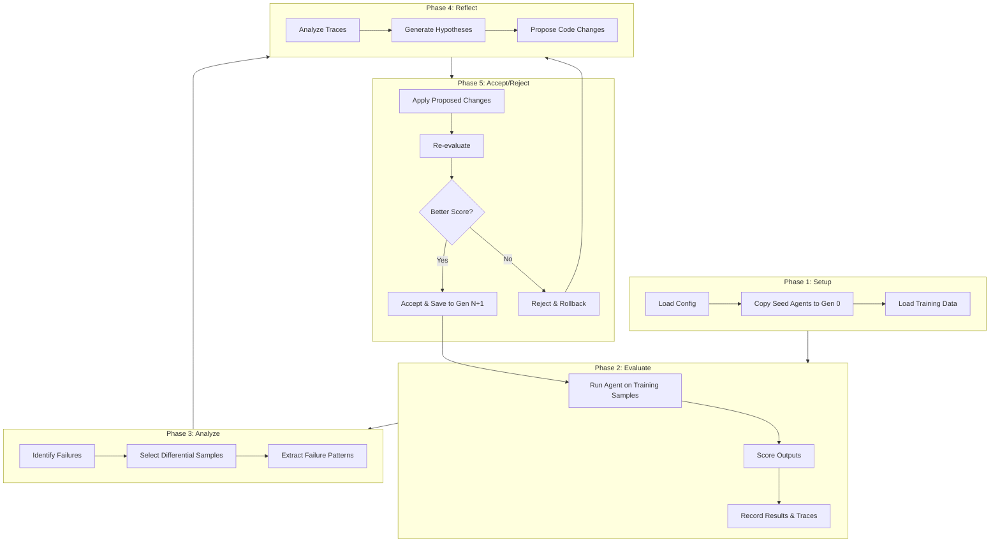
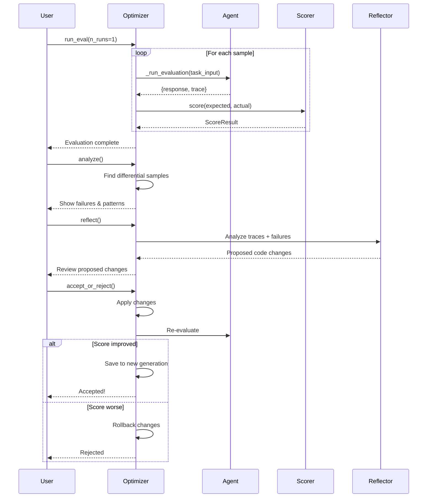
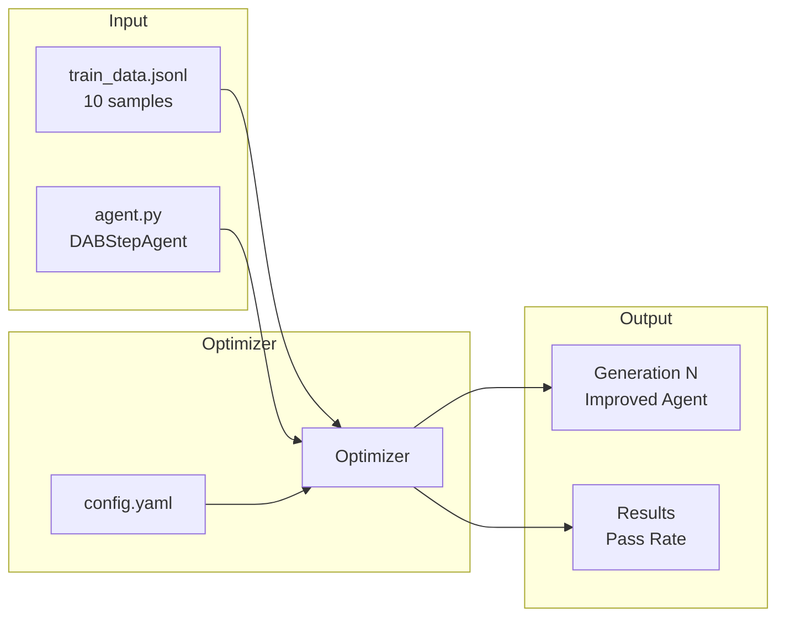

# E2E Optimization Process

## Overview

The e2e optimization loop iteratively improves agent prompts/code based on evaluation results.

## Process Diagram

## Detailed Iteration Flow

## DABStep Optimization Configuration

## Key Components

| Component | File | Purpose |
|-----------|------|---------|
| Optimizer | `optimizer.py` | Orchestrates the optimization loop |
| Config | `config.yaml` | Defines target files, scorers, objectives |
| Agent | `agent.py` | The code being optimized |
| Scorer | `scorers/*.py` | Evaluates agent outputs |
| Reflector | `agents/analyze_agent.py` | Analyzes failures, proposes changes |

## User Checkpoints

The optimization is designed for user-in-the-loop operation:

1. **After Eval**: Review pass rates and failures
2. **After Analyze**: Review differential samples
3. **After Reflect**: Review proposed code changes
4. **After Accept/Reject**: Decide to continue or stop

## Current DABStep Status

- **Baseline**: agent000 at 50% (5/10)
- **Target**: Improve pass rate through iterative optimization
- **Pareto criteria**: Success rate only (no token limits)
