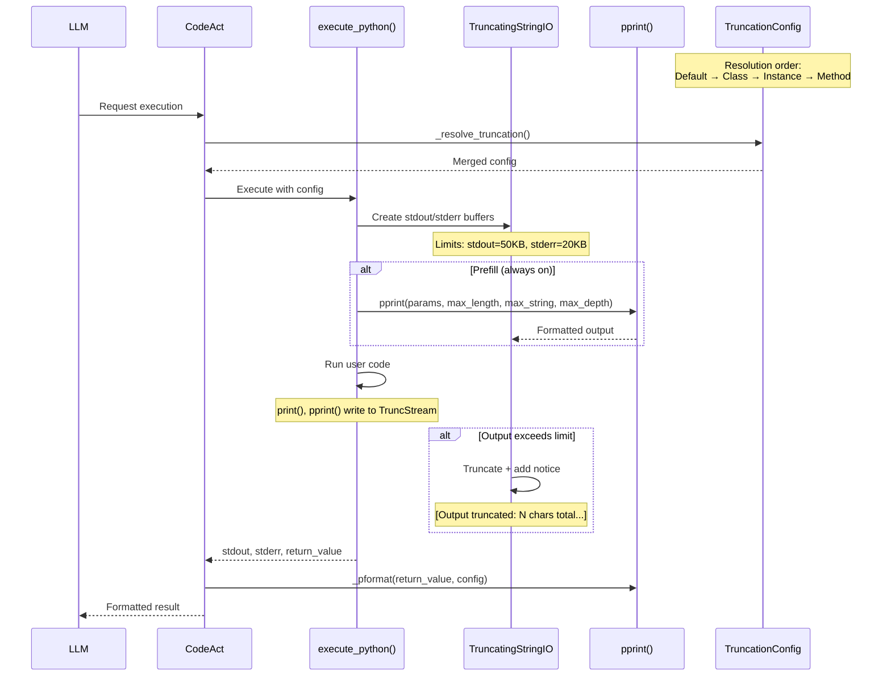

# Proposal: Stdout Safety Net and pprint()

## TLDR

Prevent LLMs from overwhelming their context window with huge outputs:

- **Three-layer defense**: Context block limits (20KB) + stdout/stderr limits (50KB/20KB) + Rich-compatible `pprint()` for smart truncation
- **No Rich dependency**: Implement pprint() ourselves, match Rich API exactly (LLMs already know it)
- **Configurable**: Set truncation limits at class/instance/method level (`class MyAgent(Agent, truncation=...)`)
- **Prefill always-on**: Parameters always shown via `pprint()` with truncation; remove duplicate `## Input parameters:` section
- **Formatter-aware notices**: XML uses nested `<truncation_notice>` tags, Markdown uses inline format
- **Variables persist**: Truncated output ≠ lost data; LLM can slice: `print(data[100:200])`

## Summary

Implement a three-layer approach to prevent LLMs from accidentally filling their context window:

1. **Context block safety net**: Hard limit per context block evaluation (20KB default)
2. **Stdout/stderr safety net**: Hard limit per `execute_python()` call (50KB/20KB)
3. **Smart printing**: Rich-compatible `pprint()` with sensible defaults (no Rich dependency)

No escape hatches - if the LLM needs more data, it slices across executions. Variables persist in the execution context.

## Motivation

### Current Problems

1. **Context blocks** can evaluate to megabytes of data that go straight into the system prompt
2. **InspectInputsPrefill** uses raw `repr()` with no truncation
3. **stdout/stderr** have no limits - `print(huge_list)` fills the context
4. **Return values** use basic `repr()` with character truncation
5. LLMs can accidentally overwhelm themselves

### Design Principles

1. **No new dependencies** - implement pprint() ourselves, don't depend on Rich
2. **Rich-compatible API** - LLMs know Rich, we match its interface
3. **Variables persist** - truncated output ≠ lost data
4. **Slicing over escape hatches** - `print(data[:100])` instead of `print_full()`
5. **Per-execution limits** - each `execute_python()` gets a fresh budget
6. **Configurable** - thresholds configurable at class/instance/method level

### Truncation Flow



## Detailed Design

### Layer 1: Stdout/Stderr Safety Net

Hard character limit per `execute_python()` call. Applies to both stdout and stderr.

```python
# src/agent006/runtime/truncating_stream.py

import io

class TruncatingStringIO(io.StringIO):
    """StringIO with hard character limit and Claude Code-style truncation notice."""

    DEFAULT_LIMIT = 50_000  # 50KB per execution

    def __init__(self, limit: int = DEFAULT_LIMIT):
        super().__init__()
        self._limit = limit
        self._truncated = False
        self._chars_written = 0

    def write(self, s: str) -> int:
        self._chars_written += len(s)

        if self._truncated:
            return len(s)  # Count but don't write

        current_size = len(self.getvalue())
        remaining = self._limit - current_size

        if len(s) <= remaining:
            return super().write(s)

        # Truncation point - write what fits, then mark truncated
        if remaining > 0:
            super().write(s[:remaining])
            super().write("...")

        self._truncated = True
        return len(s)

    def getvalue(self) -> str:
        """Get buffer contents, with truncation notice BEFORE content if truncated."""
        content = super().getvalue()

        if self._truncated:
            # Claude Code style: notice BEFORE content
            notice = (
                f"[Output truncated: {self._chars_written:,} chars total, "
                f"showing first {self._limit:,} chars]\n"
                f"Variables remain accessible. Use slicing to see more: print(data[100:200])\n\n"
            )
            return notice + content

        return content

    @property
    def was_truncated(self) -> bool:
        return self._truncated
```

**Integration in actor.py:**

```python
async def execute_code(self, code: str, ...) -> ExecutionResult:
    stdout_buffer = TruncatingStringIO(limit=self._stdout_limit)
    stderr_buffer = TruncatingStringIO(limit=self._stderr_limit)

    stdout_token = _stdout_buffer_var.set(stdout_buffer)
    stderr_token = _stderr_buffer_var.set(stderr_buffer)

    try:
        # ... execute code ...
    finally:
        _stdout_buffer_var.reset(stdout_token)
        _stderr_buffer_var.reset(stderr_token)

    return ExecutionResult(
        stdout=stdout_buffer.getvalue(),
        stderr=stderr_buffer.getvalue(),
        # ...
    )
```

### Layer 2: Rich-Compatible pprint()

Our own implementation matching Rich's `pprint()` API exactly. No Rich dependency.

**Public API (exposed to LLM):**

```python
def pprint(
    _object: Any,
    *,
    indent_guides: bool = True,
    max_length: int | None = None,     # Max container elements (None=unlimited)
    max_string: int | None = None,     # Max string characters (None=unlimited)
    max_depth: int | None = None,      # Max nesting depth (None=unlimited)
    expand_all: bool = False,          # Expand all containers
) -> None:
    """Pretty print with optional truncation.

    API compatible with rich.pretty.pprint().
    """
```

**Implementation:**

```python
# src/agent006/runtime/pprint.py

from typing import Any


def pprint(
    _object: Any,
    *,
    indent_guides: bool = True,
    max_length: int | None = None,
    max_string: int | None = None,
    max_depth: int | None = None,
    expand_all: bool = False,
) -> None:
    """Pretty print with optional truncation.

    API compatible with rich.pretty.pprint(). Formats data structures
    with intelligent truncation for large containers and strings.

    Args:
        _object: Object to print
        indent_guides: Show indent guide lines (aesthetic only in our impl)
        max_length: Max elements per container before truncating (None=unlimited)
        max_string: Max string characters before truncating (None=unlimited)
        max_depth: Max nesting depth (None=unlimited)
        expand_all: Always expand containers (vs compact for small ones)

    Examples:
        pprint(data)                      # No truncation (Rich default)
        pprint(data, max_length=50)       # Limit to 50 elements
        pprint(text, max_string=500)      # Limit string length
        pprint(nested, max_depth=3)       # Limit nesting

    Note:
        Variables persist after truncation. If output is truncated,
        access the variable directly or slice it: data[:100]
    """
    formatted = _pformat(
        _object,
        max_length=max_length,
        max_string=max_string,
        max_depth=max_depth,
        expand_all=expand_all,
    )
    print(formatted)


# ============================================================================
# Internal implementation (not exposed to LLM)
# ============================================================================

def _pformat(
    _object: Any,
    *,
    max_length: int | None = None,
    max_string: int | None = None,
    max_depth: int | None = None,
    expand_all: bool = False,
    _depth: int = 0,
    _indent: int = 0,
) -> str:
    """Return pretty-formatted string. Internal use only.

    Used by pprint() and return value formatting.
    """
    # Check depth limit
    if max_depth is not None and _depth >= max_depth:
        return _format_shallow(_object, max_string)

    # Handle by type
    if isinstance(_object, str):
        return _format_string(_object, max_string)

    if isinstance(_object, dict):
        return _format_dict(
            _object,
            max_length=max_length,
            max_string=max_string,
            max_depth=max_depth,
            expand_all=expand_all,
            depth=_depth,
            indent=_indent,
        )

    if isinstance(_object, (list, tuple, set, frozenset)):
        return _format_sequence(
            _object,
            max_length=max_length,
            max_string=max_string,
            max_depth=max_depth,
            expand_all=expand_all,
            depth=_depth,
            indent=_indent,
        )

    # Fallback to repr for other types
    result = repr(_object)
    if max_string and len(result) > max_string:
        return result[:max_string] + f"... +{len(result) - max_string}"
    return result


def _format_string(s: str, max_string: int | None) -> str:
    """Format a string, potentially truncating."""
    if max_string is None or len(s) <= max_string:
        return repr(s)

    # Truncate and show count of remaining chars
    truncated = s[:max_string]
    remaining = len(s) - max_string
    return repr(truncated)[:-1] + f"... +{remaining}'"


def _format_shallow(_object: Any, max_string: int | None) -> str:
    """Format object shallowly (at max depth)."""
    type_name = type(_object).__name__

    if isinstance(_object, dict):
        return f"{{{type_name}: {len(_object)} items}}"
    if isinstance(_object, (list, tuple, set, frozenset)):
        brackets = _get_brackets(type(_object))
        return f"{brackets[0]}{type_name}: {len(_object)} items{brackets[1]}"
    if isinstance(_object, str):
        return _format_string(_object, max_string)

    return repr(_object)


def _format_dict(
    d: dict,
    *,
    max_length: int | None,
    max_string: int | None,
    max_depth: int | None,
    expand_all: bool,
    depth: int,
    indent: int,
) -> str:
    """Format a dictionary."""
    if not d:
        return "{}"

    # Compact format for small dicts when not expand_all
    if not expand_all and len(d) <= 3 and depth > 0:
        items = []
        for k, v in d.items():
            k_str = _format_string(str(k), 50) if isinstance(k, str) else repr(k)
            v_str = _pformat(v, max_length=max_length, max_string=max_string,
                           max_depth=max_depth, expand_all=expand_all,
                           _depth=depth+1, _indent=0)
            items.append(f"{k_str}: {v_str}")
        result = "{" + ", ".join(items) + "}"
        if len(result) < 80:
            return result

    # Expanded format
    lines = ["{"]
    items = list(d.items())

    # Truncate if needed
    truncated_count = 0
    if max_length is not None and len(items) > max_length:
        truncated_count = len(items) - max_length
        items = items[:max_length]

    inner_indent = "    " * (indent + 1)
    for k, v in items:
        k_str = _format_string(str(k), 50) if isinstance(k, str) else repr(k)
        v_str = _pformat(v, max_length=max_length, max_string=max_string,
                        max_depth=max_depth, expand_all=expand_all,
                        _depth=depth+1, _indent=indent+1)
        lines.append(f"{inner_indent}{k_str}: {v_str},")

    if truncated_count > 0:
        lines.append(f"{inner_indent}... +{truncated_count}")

    lines.append("    " * indent + "}")
    return "\n".join(lines)


def _format_sequence(
    seq,
    *,
    max_length: int | None,
    max_string: int | None,
    max_depth: int | None,
    expand_all: bool,
    depth: int,
    indent: int,
) -> str:
    """Format a sequence (list, tuple, set, frozenset)."""
    brackets = _get_brackets(type(seq))

    if not seq:
        return brackets[0] + brackets[1]

    items = list(seq)

    # Compact format for small sequences when not expand_all
    if not expand_all and len(items) <= 5 and depth > 0:
        formatted = [_pformat(x, max_length=max_length, max_string=max_string,
                             max_depth=max_depth, expand_all=expand_all,
                             _depth=depth+1, _indent=0) for x in items[:5]]
        result = brackets[0] + ", ".join(formatted) + brackets[1]
        if len(result) < 80:
            return result

    # Expanded format
    lines = [brackets[0]]

    # Truncate if needed
    truncated_count = 0
    if max_length is not None and len(items) > max_length:
        truncated_count = len(items) - max_length
        items = items[:max_length]

    inner_indent = "    " * (indent + 1)
    for item in items:
        item_str = _pformat(item, max_length=max_length, max_string=max_string,
                           max_depth=max_depth, expand_all=expand_all,
                           _depth=depth+1, _indent=indent+1)
        lines.append(f"{inner_indent}{item_str},")

    if truncated_count > 0:
        lines.append(f"{inner_indent}... +{truncated_count}")

    lines.append("    " * indent + brackets[1])
    return "\n".join(lines)


def _get_brackets(seq_type: type) -> tuple[str, str]:
    """Get opening and closing brackets for sequence type."""
    if seq_type == list:
        return "[", "]"
    if seq_type == tuple:
        return "(", ")"
    if seq_type == set:
        return "{", "}"
    if seq_type == frozenset:
        return "frozenset({", "})"
    return "[", "]"
```

### Layer 3: Context Block Safety Net

Context blocks can evaluate to massive strings that fill the LLM's context before execution even begins.

**The Risk:**
```python
# In agent definition
Block(key="available_tools", expr="self.doc()")  # Could return 500KB of tool docs
Block(key="dataset", expr="self.load_data()")     # Could return megabytes
```

#### Solution: Truncate at evaluation time

Truncation happens in `BlockRenderer.render()` after evaluating block expressions:

```python
# In context-blocks package: renderer.py

def render(self, spec: ContextSpec, ...) -> Any:
    # Evaluate context blocks
    context_values: dict[str, str] = {}
    block_metadata: dict[str, dict] = {}

    for block in spec.context.blocks:
        if not eval(block.show):
            continue

        value = eval(block.expr)
        if value is None:
            raise BlockEvaluationError(block.key, block.expr)

        # NEW: Truncate if too large
        value_str = str(value)
        truncated_data = None

        if len(value_str) > context_block_limit:
            truncated_data = {
                "truncated": True,
                "total_chars": len(value_str),
                "shown_chars": context_block_limit,
            }
            value_str = value_str[:context_block_limit]

        context_values[block.key] = value_str

        # Collect metadata for formatter
        block_metadata[block.key] = {
            "expr": block.expr,
            "update": block.update,
            "timestamp": block.last_updated.isoformat() if block.last_updated else None,
            "truncation": truncated_data,  # NEW: pass truncation info to formatter
        }

    # Format context blocks with truncation notices
    context_str = block_formatter.format(context_values, block_metadata)
    ...
```

**Block Formatter Integration:**

Formatters handle truncation notices in their native style:

**XMLBlockFormatter:**
```python
def format(self, blocks: dict[str, str], block_metadata: dict[str, dict] | None = None) -> str:
    parts = []
    for key, content in blocks.items():
        attrs = ""
        truncation_notice = ""

        if block_metadata and key in block_metadata:
            meta = block_metadata[key]

            # Build attributes
            attr_parts = []
            if "expr" in meta:
                attr_parts.append(f'expr="{meta["expr"]}"')
            if "timestamp" in meta:
                attr_parts.append(f'timestamp="{meta["timestamp"]}"')

            # Handle truncation
            if "truncation" in meta and meta["truncation"]:
                trunc = meta["truncation"]
                attr_parts.append(f'truncated="true"')
                attr_parts.append(f'total_chars="{trunc["total_chars"]}"')
                attr_parts.append(f'shown_chars="{trunc["shown_chars"]}"')

                # Build truncation notice as nested XML tag
                truncation_notice = (
                    f"<truncation_notice>"
                    f"Content truncated: {trunc['total_chars']:,} chars total, "
                    f"showing first {trunc['shown_chars']:,} chars"
                    f"</truncation_notice>\n\n"
                )

            if attr_parts:
                attrs = " " + " ".join(attr_parts)

        parts.append(f"<{key}{attrs}>\n{truncation_notice}{content}\n</{key}>")
    return "\n\n".join(parts)
```

**Example XML output:**
```xml
<available_tools expr="self.doc()" truncated="true" total_chars="523891" shown_chars="20000">
<truncation_notice>Content truncated: 523,891 chars total, showing first 20,000 chars</truncation_notice>

...truncated tool documentation...
</available_tools>
```

**MarkdownBlockFormatter:**
```python
def format(self, blocks: dict[str, str], block_metadata: dict[str, dict] | None = None) -> str:
    parts = []
    for key, content in blocks.items():
        header = key.replace("_", " ").title()

        # Build inline metadata
        inline_meta = ""
        truncation_notice = ""

        if block_metadata and key in block_metadata:
            meta = block_metadata[key]
            dict_parts = []

            if "expr" in meta:
                dict_parts.append(f'"expr": "{meta["expr"]}"')
            if "timestamp" in meta and meta["timestamp"]:
                dict_parts.append(f'"timestamp": "{meta["timestamp"]}"')

            # Handle truncation
            if "truncation" in meta and meta["truncation"]:
                trunc = meta["truncation"]
                dict_parts.append(f'"truncated": true')
                dict_parts.append(f'"total_chars": {trunc["total_chars"]}')
                dict_parts.append(f'"shown_chars": {trunc["shown_chars"]}')

                # Build truncation notice as plain text
                truncation_notice = (
                    f"\n\n[Content truncated: {trunc['total_chars']:,} chars total, "
                    f"showing first {trunc['shown_chars']:,} chars]\n\n"
                )

            if dict_parts:
                inline_meta = " `{" + ", ".join(dict_parts) + "}`"

        parts.append(f"# {header}{inline_meta}{truncation_notice}\n\n{content}")
    return "\n\n".join(parts)
```

**Example Markdown output:**
```markdown
# Available Tools `{"expr": "self.doc()", "truncated": true, "total_chars": 523891, "shown_chars": 20000}`

[Content truncated: 523,891 chars total, showing first 20,000 chars]

...truncated tool documentation...
```

### Configuration System

Truncation settings configurable at class, instance, and method level (like LLM configuration):

```python
# src/agent006/runtime/truncation_config.py

from dataclasses import dataclass, field
from typing import Any

@dataclass
class TruncationConfig:
    """Configuration for output truncation.

    Can be set at class, instance, or method level.
    More specific settings override less specific ones (merge with override).
    """
    # Safety net limits
    context_block_limit: int = 20_000  # 20KB per context block evaluation
    stdout_limit: int = 50_000         # 50KB per execute_python call
    stderr_limit: int = 20_000         # 20KB per execute_python call

    # Default pprint limits (used by prefill inspection AND return value formatting)
    # These are the automatic truncation limits applied by the framework.
    # LLM-generated pprint() calls use Rich defaults (None = no truncation).
    max_length: int | None = 50     # Max container elements
    max_string: int | None = 500    # Max string characters
    max_depth: int | None = 4       # Max nesting depth

    def merge_with(self, other: "TruncationConfig | None") -> "TruncationConfig":
        """Merge with another config (other takes precedence for non-None values)."""
        if other is None:
            return self
        return TruncationConfig(
            context_block_limit=other.context_block_limit if other.context_block_limit != 20_000 else self.context_block_limit,
            stdout_limit=other.stdout_limit if other.stdout_limit != 50_000 else self.stdout_limit,
            stderr_limit=other.stderr_limit if other.stderr_limit != 20_000 else self.stderr_limit,
            max_length=other.max_length if other.max_length is not None else self.max_length,
            max_string=other.max_string if other.max_string is not None else self.max_string,
            max_depth=other.max_depth if other.max_depth is not None else self.max_depth,
        )


# Default configuration
DEFAULT_TRUNCATION_CONFIG = TruncationConfig()
```

**Usage in agent definition:**

```python
from agent006 import Agent
from agent006.runtime import TruncationConfig

# Class-level config (via __init_subclass__)
class DataAnalysisAgent(Agent, llm=my_llm, truncation=TruncationConfig(stdout_limit=100_000)):

    # Method-level override via @strategy decorator
    @strategy(
        CodeActStrategy(),
        truncation=TruncationConfig(max_length=100)  # More elements visible
    )
    async def analyze_large_dataset(self, data: list) -> Result:
        ...


# Instance-level override
agent = DataAnalysisAgent(truncation=TruncationConfig(stdout_limit=200_000))
```

**Resolution order (merge with override):**
1. Library defaults (`TruncationConfig()`)
2. Class-level (`class MyAgent(Agent, truncation=...)`)
3. Instance-level (`MyAgent(truncation=...)`)
4. Method-level (`@strategy(..., truncation=...)`)

### Return Value Formatting

Return values use `_pformat()` internally with unified config:

```python
# In codeact.py _format_tool_result

def _format_tool_result(self, result: Any, *, execution_count: int = 0) -> str:
    parts = []

    if result.error:
        parts.append(f"Execution error:\n{self._format_error(result.error, ...)}")
        output_text = result.format_output(fenced=False)
        if output_text:
            parts.append(f"\n{output_text}")
    else:
        parts.append("Execution successful.")

        output_text = result.format_output(fenced=False)
        if output_text:
            parts.append(f"\n{output_text}")

        if result.has_return:
            from agent006.runtime.pprint import _pformat

            config = self._get_truncation_config()

            returned_repr = _pformat(
                result.returned_value,
                max_length=config.max_length,
                max_string=config.max_string,
                max_depth=config.max_depth,
            )
            parts.append(f"\nOut[{execution_count}]: {returned_repr}")

    return "".join(parts)
```

### Prefill as Default (Simplification)

**Decision**: Make prefill always-on by default. This simplifies the implementation:

1. **One code path** - no conditional logic for "with prefill" vs "without prefill"
2. **Consistent truncation** - parameters always shown via `pprint()` with truncation
3. **Simpler task message** - remove `## Input parameters:` section entirely (prefill handles it)
4. **Less code to maintain and test**

```python
# Simplified _build_task_message - no parameters section

@strategy(TemplateStrategy())
async def _build_task_message(
    self, runtime: RuntimeServices, original_call: "CurrentCall"
) -> str:
    """
    # Your task
    {original_call.docstring}

    ## Method signature:
    {original_call.format_signature()}

    Please perform the task now.
    """
    ...
```

**CodeActStrategy changes:**
- Remove `prefill: Prefill | None = None` parameter
- Always use `InspectInputsPrefill` internally
- Hardcode `show_return_type=True` (always show return type structure)

```python
class CodeActStrategy(GenerationStrategy):
    def __init__(
        self,
        *,
        max_iterations: int = 10,
        max_retries: int = 3,
        error_formatter: "IPythonErrorFormatter | None" = None,
    ):
        self.max_iterations = max_iterations
        self.max_retries = max_retries
        self.error_formatter = error_formatter
        # Prefill always enabled, always shows return type
```

### Prefill Integration

Prefill uses the unified `TruncationConfig`:

```python
# Modified prefill.py

class InspectInputsPrefill:
    """Prefill that inspects input parameters with pprint(). Always shows return type."""

    def get_code(self, call: "CurrentCall", config: TruncationConfig) -> str | None:
        """Generate prefill code using truncation config.

        Args:
            call: Current method call info
            config: Resolved TruncationConfig (from class/instance/method)
        """
        param_names = list(call.kwargs.keys())
        if not param_names:
            return None

        method_name = call.method_name

        code_lines = [
            f'reasoning("""Let me inspect the inputs.\n\n'
            f"Reminders:\n"
            f"- Do not call self.{method_name}() - infinite recursion\n"
            f"- Do not redefine {method_name} - I am implementing it\n"
            f'- Return directly if possible""")',
            'print(f"Call: {_call.format_signature()}")',
        ]

        # Use config values (literals so LLM sees what was called)
        for param in param_names:
            code_lines.append(f'print(f"\\n{param} ({{type({param}).__name__}}):")')
            code_lines.append(
                f'pprint({param}, max_length={config.max_length}, '
                f'max_string={config.max_string}, max_depth={config.max_depth})'
            )

        # Always show return type for complex types
        if call.return_type:
            complex_type = _get_complex_type(call.return_type)
            if complex_type is not None:
                type_info = _format_type_compact(call.return_type)
                code_lines.append(f'print("\\nReturn type: {type_info}")')

        return "\n".join(code_lines)
```

### Namespace Integration

```python
# In ExecutionNamespaceBuilder.build()

from agent006.runtime.pprint import pprint

namespace.update({
    # ... existing items ...

    # Pretty printing (Rich-compatible API)
    "pprint": pprint,
})
```

### LLM Instruction Changes

Three locations in `codeact.py` need updates:

#### 1. `execution_context()` - "Always available" list

```python
# Before (line ~269):
parts.append(
    "**Always available**: `self`, `print()`, `doc()`, `brief()`, `return_result()`, method parameters"
)

# After:
parts.append(
    "**Always available**: `self`, `print()`, `pprint()`, `doc()`, `brief()`, `return_result()`, method parameters"
)
```

#### 2. `strategy_instructions()` - Main CodeAct instructions

Update the docstring template (lines ~274-326):

```python
@strategy(TemplateStrategy())
async def strategy_instructions(self, runtime: RuntimeServices) -> str:
    """## CodeAct Mode (Tool-Based Code Execution)

    You have two tools available:

    1. **`execute_python(code)`** - Run Python code for computation and exploration
       - Use this to perform calculations, inspect data, call methods on `self`
       - You can call this multiple times as needed
       - Variables and helper functions persist across calls
       - **EFFICIENCY TIP**: You can call `return_result(...)` from within your code
         to compute and return the final answer in one step!

    2. **`return_result(value)`** - Return the final answer when you're done
       - Call this ONLY when you have computed the final result
       - Pass the result matching the expected return type
       - Can be called as a separate tool OR from within `execute_python` code

    **Workflow**:
    1. Think about what you need to do.
       - **TIP:** If you have good confidence that you know the answer to the task
         (e.g. if a single LLM reasoning step is enough), directly output it using
         `return_result(...)` - no need to run artificial code to compute something
         you already know.
    2. Call `execute_python(code)` to run computations
       - If you know this is the final computation, call `return_result(...)` at the end!
    3. Observe the results (if using multiple steps)
    4. Repeat steps 1-3 as needed
    5. When ready, call `return_result(...)` (as tool or from within code)

    **In your code you have access to**:
    - `self` - The agent instance with all its attributes and methods
    - `print(...)` - Output values (for small/simple data)
    - `pprint(...)` - Pretty print with optional truncation (Rich-compatible API)
    - `doc(obj)` - To get interfaces of any class or object
    - Method parameters as local variables
    - Helper functions you define persist across calls

    **Output and truncation**:
    - Use `print()` for simple, small outputs
    - Use `pprint(data, max_length=N, max_string=N, max_depth=N)` for large data structures
    - stdout is limited per execution; if truncated, you'll see a notice at the top
    - Variables persist even if output is truncated - use slicing to see more: `print(data[100:200])`

    **Code execution notes**:
    - Use `doc(obj)` to inspect objects, attributes and types - see "Execution Context"
    - Trust interfaces described by `doc(cls)` or `doc(cls.method)`. No need to inspect code!
    - **You ARE in an async context** - use `await` directly for async methods
      Example: `result = await self.some_async_method()`
    - Do NOT use `asyncio.run()` or `loop.run_until_complete()` - they will fail!
    - Do NOT use `import` statements - all required imports are already available

    **About execution output**:
    - When you call `execute_python(code)`, you receive an immediate status response
    - The actual execution output (stdout, return values) appears in a subsequent message
    - Reference previous outputs using `Out[n]` in your code (e.g., `Out[1]` for first execution's result)
    - `Out[-1]` gives you the most recent execution result

    **Important**:
    - You MUST call one of the two tools. Text responses are just for reasoning.
    - Do NOT try to return the answer in text - you MUST use the `return_result(...)` tool"""
    ...
```

#### 3. `pprint()` docstring (shown via `doc(pprint)`)

The `pprint()` function docstring serves as documentation when the LLM calls `doc(pprint)`:

```python
def pprint(
    _object: Any,
    *,
    indent_guides: bool = True,
    max_length: int | None = None,
    max_string: int | None = None,
    max_depth: int | None = None,
    expand_all: bool = False,
) -> None:
    """Pretty print with optional truncation (Rich-compatible API).

    Args:
        _object: Object to print
        max_length: Max elements per container (None=unlimited)
        max_string: Max string characters (None=unlimited)
        max_depth: Max nesting depth (None=unlimited)
        expand_all: Always expand containers (default: compact for small ones)

    Examples:
        pprint(data)                      # No truncation
        pprint(data, max_length=50)       # Limit to 50 elements
        pprint(text, max_string=500)      # Limit string length
        pprint(nested, max_depth=3)       # Limit nesting

    Note:
        Variables persist after truncation. If you need more data,
        slice it: print(data[100:200])
    """
```

## Example Output

### pprint() with Truncation (Rich-style)

```python
pprint(users, max_length=5)  # Explicit truncation
```

Output:
```text
[
    {'id': 1, 'name': 'Alice', 'email': 'alice@example.com'},
    {'id': 2, 'name': 'Bob', 'email': 'bob@example.com'},
    {'id': 3, 'name': 'Charlie', 'email': 'charlie@example.com'},
    {'id': 4, 'name': 'Diana', 'email': 'diana@example.com'},
    {'id': 5, 'name': 'Eve', 'email': 'eve@example.com'},
    ... +9995
]
```

### pprint() without Truncation (Rich default)

```python
pprint(small_data)  # No truncation by default (matches Rich)
```

Output:
```text
[
    {'id': 1, 'name': 'Alice'},
    {'id': 2, 'name': 'Bob'},
    {'id': 3, 'name': 'Charlie'},
]
```

### Safety Net Output (Claude Code-style)

```python
print(huge_dataframe.to_string())
```

Output:
```text
[Output truncated: 2,345,678 chars total, showing first 50,000 chars]
Variables remain accessible. Use slicing to see more: print(data[100:200])

   col1  col2  col3  col4  col5
0     1     2     3     4     5
1     6     7     8     9    10
... (many more rows) ...
5000  ...
```

### Return Value Output

```python
data  # Bare expression
```

Output:
```text
Execution successful.

Out[1]: [
    {'id': 1, 'name': 'Alice'},
    {'id': 2, 'name': 'Bob'},
    ... +998
]
```

## Configuration Defaults

| Setting | Default | Description |
|---------|---------|-------------|
| `context_block_limit` | 20,000 | Safety net for context block evaluation (chars) |
| `stdout_limit` | 50,000 | Safety net for stdout (chars) |
| `stderr_limit` | 20,000 | Safety net for stderr (chars) |
| `max_length` | 50 | Max container elements (prefill + return values) |
| `max_string` | 500 | Max string characters (prefill + return values) |
| `max_depth` | 4 | Max nesting depth (prefill + return values) |

**Note:**
- `pprint()` called by LLM uses Rich defaults (None = no truncation)
- Framework-generated output (prefill, return values) uses `TruncationConfig` defaults
- All settings configurable at class/instance/method level

## Known Limitations

### Thread Safety

Output capture uses `contextvars`. When LLM-generated code spawns threads:
- Each thread may get an isolated context copy
- Output from worker threads could be lost

This is an edge case for most agent tasks. Document as known limitation.

### Structural Truncation

Safety net truncation may break output structure (e.g., mid-JSON). This is acceptable - the truncation notice makes it clear output is incomplete.

## Implementation Plan

### Phase 1: Core
1. Create `src/agent006/runtime/truncating_stream.py`
2. Create `src/agent006/runtime/pprint.py` (Rich-compatible API, no dependency)
   - Public: `pprint()`
   - Internal: `_pformat()` (used by return value formatting)
3. Create `src/agent006/runtime/truncation_config.py`
4. Add unit tests

### Phase 2: Integration
5. Update `actor.py` to use `TruncatingStringIO` for stdout/stderr
6. Update `ExecutionNamespaceBuilder` to expose `pprint` only
7. Update `InspectInputsPrefill` to use `pprint()` with config values
8. Update `_format_tool_result` to use internal `_pformat()`
9. Make prefill always-on in `CodeActStrategy`:
   - Remove `prefill` parameter
   - Remove `## Input parameters:` from `_build_task_message`
   - Always run `InspectInputsPrefill` internally

### Phase 3: Configuration
9. Wire up `TruncationConfig` at class/instance/method levels (merge with override)
10. Update `CodeActStrategy` to accept truncation config
11. Update `Agent.__init_subclass__` and `Agent.__init__` to accept `truncation=`

### Phase 4: LLM Instructions
12. Update `execution_context()` - add `pprint()` to "Always available" list
13. Update `strategy_instructions()` docstring:
    - Add `pprint(...)` to "In your code you have access to"
    - Add new "Output and truncation" section
14. Ensure `pprint()` docstring is comprehensive (shown via `doc(pprint)`)

### Phase 5: Context Block Truncation (context-blocks package)
15. Update `BlockRenderer.render()` to truncate large block values
    - Add truncation logic after `eval(block.expr)`
    - Pass truncation metadata to `block_formatter.format()`
16. Update `XMLBlockFormatter.format()`:
    - Handle `truncation` metadata in `block_metadata`
    - Add `truncated`, `total_chars`, `shown_chars` attributes to opening tag
    - Generate nested `<truncation_notice>` tag when truncated
17. Update `MarkdownBlockFormatter.format()`:
    - Handle `truncation` metadata in inline metadata dict
    - Generate plain text truncation notice before content
18. Pass `TruncationConfig.context_block_limit` from agent006 to BlockRenderer
19. Add unit tests for context block truncation

## References

- [Rich Pretty Printing](https://rich.readthedocs.io/en/latest/pretty.html) - API we're matching
- [Rich API Reference](https://rich.readthedocs.io/en/stable/reference/pretty.html) - Function signatures
- Claude Code truncation pattern - Inspiration for safety net format
