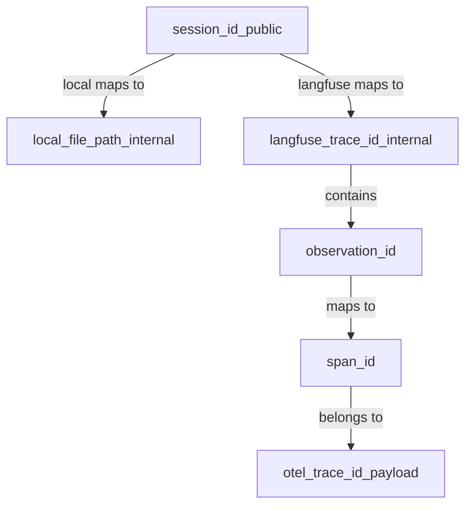

# SessionId_andTraceGroup_API_Refactor

## Objective

Unify the backend API across Local and Langfuse by:

- Using **`session_id`** (not `trace_id`) as the public identifier for list/load/annotations/chains.
- Replacing the file-centric `TraceFile` API with provider-agnostic **`TraceGroup`**.
- Keeping provider-native identifiers (local `file_path`, Langfuse `trace.id`, Langfuse `observation_id`, OTel `trace_id`) internal.

## ID glossary (contract)

- **`session_id` (public)**: group/run handle used by all relevant endpoints.
- **`trace_id` (payload)**: OTel trace id inside spans/events (identity within data, not for lookup).
- **`span_id` (payload)**: span identity; Langfuse maps this to `observation_id`.
- **`file_path` (internal)**: local storage locator.
- **Langfuse `trace.id` (internal)**: native container id for fetching.

## API changes (breaking)

### Replace list model

- Change `/api/traces` response from `list[TraceFile]` to `list[TraceGroup]`.

### Rename public handle on endpoints

Rename the identifier parameter from `trace_id` to **`session_id`** on these endpoints:

- `/api/trace` : `?session_id=...`
- `/api/trace-count` : `?session_id=...`
- `/api/trace/chains` : `?session_id=...`
- `/api/traces/{session_id:path}/annotations`
- `/api/spans/{span_id}/annotations?session_id=...`

### Annotation payload

- Update `Annotation.trace_id` to **`session_id`** in [`util/trace-viewer/backend/models.py`](util/trace-viewer/backend/models.py), and update all request/response payloads accordingly.

## Provider refactor

### New provider interface

In [`util/trace-viewer/backend/providers.py`](util/trace-viewer/backend/providers.py), replace `TraceProvider` methods with:

- `list_groups() -> list[TraceGroup]`
- `get_session(session_id: str) -> dict[str, Any] `returning the same shape as today `{format, path, events}`
- `get_annotations(session_id: str, span_id: str | None = None) -> list[Annotation]`
- `create_annotation(annotation: Annotation) -> Annotation` (where `annotation.session_id` is the routing key)

### LangfuseProvider

- Group by `metadata.resourceAttributes.session.id` (already used today).
- Remove `TraceFile(filename=...)` usage entirely.
- Add internal cache/index:
  - `session_id -> [langfuse_trace_id]`
  - optional `span_id -> langfuse_trace_id` (lazy) to route span-level annotation writes.
- Ensure returned spans remain normalized to the viewer format; provider-native IDs remain internal.

### LocalProvider

- Treat `.006trace.jsonl` as an export container.
- Determine `session_id` by scanning content; if missing, assign **`ungrouped`**.
- Build/cache `session_id -> [file_path]`.
- `get_session(session_id)` concatenates events/spans from all files in the group.

## Backend wiring

In [`util/trace-viewer/backend/main.py`](util/trace-viewer/backend/main.py):

- Update route signatures + query param names to `session_id`.
- Update call sites to use `provider.get_session(session_id)`.
- Update chain endpoint to use `session_id` (still computes hierarchy/chains from returned data).

## Frontend updates

In [`util/trace-viewer/frontend/js/trace-loader.js`](util/trace-viewer/frontend/js/trace-loader.js):

- Replace all uses of `trace_id` query param with `session_id`.
- Ensure the list page uses `TraceGroup.id` as the navigation handle.

## Parity test update

In [`util/trace-viewer/test_parity.py`](util/trace-viewer/test_parity.py):

- Use the generated `session.id` as the single identifier passed to both backends.
- Update API calls to use `session_id` params and `/api/traces/{session_id}/annotations`.

## Implementation todos

- **models-tracegroup**: Add `TraceGroup`; rename `Annotation.trace_id` -> `session_id`; update related models/typing.
- **providers-session**: Refactor Local/Langfuse providers to list/get by session_id; add minimal caching; remove Langfuse `filename` mismatch.
- **api-frontend-parity**: Rename API params/routes to session_id, update frontend JS, update parity test script.

## Mermaid: relationships

