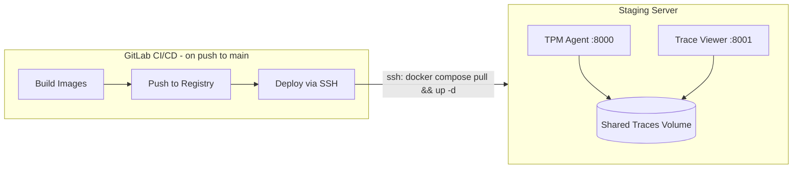

# TPM Agent Docker Compose Deployment

## Summary

Set up containerized deployment for the TPM agent and trace viewer with:
- Docker Compose configuration for both services
- GitLab CI/CD pipeline for building, pushing, and deploying on main branch
- CI/CD-triggered deployments (no Watchtower - it was [archived Dec 2025](https://github.com/containrrr/watchtower/discussions/2135))

## Architecture



## Implementation

### 1. Create Deployment Directory Structure

Create `deploy/` directory with:
- `docker-compose.yml` - Services: tpm-agent, trace-viewer, shared volumes
- `.env.example` - Template for required environment variables

### 2. Fix TPM Agent Dockerfile

Update [`agents/tpm-agent/Dockerfile`](../../agents/tpm-agent/Dockerfile) with proper uv layer caching:

**Key patterns for efficient builds:**

**Pattern 1: UV binary from official image** (no pip install needed):
```dockerfile
FROM python:3.12-slim-bookworm
COPY --from=ghcr.io/astral-sh/uv:latest /uv /uvx /bin/
```

**Pattern 2: UV environment variables**:
```dockerfile
ENV UV_COMPILE_BYTECODE=1  # Faster runtime startup (pre-compiled .pyc)
ENV UV_LINK_MODE=copy      # Required for Docker (can't use hard links)
ENV UV_PYTHON_DOWNLOADS=0  # Use system Python, don't download
```

**Pattern 3: APT cache mounts** (persist across builds):
```dockerfile
RUN --mount=type=cache,target=/var/cache/apt,sharing=locked \
    --mount=type=cache,target=/var/lib/apt,sharing=locked \
    rm -f /etc/apt/apt.conf.d/docker-clean && \
    apt-get update && apt-get install -y git
```

**Pattern 4: Two-stage dependency install** (CRITICAL for layer caching):
```dockerfile
# Stage 1: Install deps only (cached if pyproject.toml/uv.lock unchanged)
RUN --mount=type=cache,target=/root/.cache/uv \
    --mount=type=bind,source=uv.lock,target=uv.lock \
    --mount=type=bind,source=pyproject.toml,target=pyproject.toml \
    uv sync --frozen --no-default-groups

# Stage 2: Copy source code (changes frequently - separate layer)
COPY --chown=app:app . /app

# Stage 3: Install the project itself
RUN --mount=type=cache,target=/root/.cache/uv \
    uv sync --frozen --no-group dev
```

This ensures source code changes don't invalidate the expensive dependency cache layer!

**Pattern 5: Non-root user** (security best practice):
```dockerfile
RUN useradd -ms /bin/bash app
USER app
```

**Pattern 6: PATH setup** (venv as default Python):
```dockerfile
ENV PATH="/app/.venv/bin:$PATH"
```

### 3. Create Trace Viewer Dockerfile

New `util/trace-viewer/Dockerfile`:
- Apply same uv layer caching patterns as TPM agent
- FastAPI backend serving static frontend
- Minimal Python image with uvicorn
- Expose port 8001

### 4. Update GitLab CI/CD Pipeline

Add to [`.gitlab-ci.yml`](../../.gitlab-ci.yml) following your example pattern:

```yaml
# Build stage - parallel matrix build
build_image:
  stage: build
  image: docker:24.0.5
  parallel:
    matrix:
      - IMAGE:
          - tpm-agent|agents/tpm-agent
          - trace-viewer|util/trace-viewer
  script:
    - docker build -f ${DOCKERFILE_PATH}/Dockerfile -t $CI_REGISTRY_IMAGE/${NAME}:latest .
  rules:
    - if: $CI_COMMIT_BRANCH == $CI_DEFAULT_BRANCH

# Push images to registry
push_image:
  stage: deploy
  needs: [build_image]
  script:
    - docker build ... --push
  rules:
    - if: $CI_COMMIT_BRANCH == $CI_DEFAULT_BRANCH

# Deploy to staging via SSH
deploy_staging:
  stage: deploy
  needs: [push_image]
  image: debian:latest
  script:
    - scp deploy/docker-compose.yml ${USER}@${WEBSERVER}:/root/
    - ssh ${USER}@${WEBSERVER} "docker compose pull && docker compose up -d"
  rules:
    - if: $CI_COMMIT_BRANCH == $CI_DEFAULT_BRANCH
```

**CI/CD Variables needed** (GitLab Settings > CI/CD > Variables):

| Variable | Type | Description |
|----------|------|-------------|
| `SSH_PRIVATE_KEY` | File, Protected | SSH key for server access |
| `DEPLOY_SERVER` | Variable | Server IP (you'll provide later) |
| `DEPLOY_USER` | Variable | SSH user (typically `root`) |

### 5. Docker Compose Configuration

```yaml
# deploy/docker-compose.yml
services:
  tpm-agent:
    image: ${CI_REGISTRY_IMAGE:-registry.gitlab.com/your/repo}/tpm-agent:${TAG:-latest}
    restart: unless-stopped
    ports:
      - "8000:8000"
    volumes:
      - traces:/app/traces
    env_file: .env

  trace-viewer:
    image: ${CI_REGISTRY_IMAGE:-registry.gitlab.com/your/repo}/trace-viewer:${TAG:-latest}
    restart: unless-stopped
    ports:
      - "8001:8001"
    volumes:
      - traces:/app/traces:ro
    environment:
      - TRACE_DIRECTORIES=/app/traces

volumes:
  traces:
```

### 6. Update TPM Agent Code

Modify [`agents/tpm-agent/tpm_agent.py`](../../agents/tpm-agent/tpm_agent.py):
- Remove `_check_and_update()` method entirely (lines 607-687)
- Remove the auto-update check in `monitor_and_schedule()` (lines 588-594)

### 7. Update Documentation

Rewrite [`agents/tpm-agent/README.md`](../../agents/tpm-agent/README.md):
- Document new CI/CD deployment workflow
- Document GitLab webhook configuration for the server
- Document required CI/CD variables
- Remove references to non-existent docker-compose.yml

## Files Changed

| File | Action |
|------|--------|
| `deploy/docker-compose.yml` | Create |
| `deploy/.env.example` | Create |
| `agents/tpm-agent/Dockerfile` | Rewrite with uv layer caching |
| `util/trace-viewer/Dockerfile` | Create with uv layer caching |
| `.gitlab-ci.yml` | Add build/deploy stages |
| `agents/tpm-agent/tpm_agent.py` | Remove auto-update code |
| `agents/tpm-agent/README.md` | Rewrite |

## Implementation Checklist

- [ ] Create deploy/ with docker-compose.yml and .env.example
- [ ] Rewrite TPM agent Dockerfile with uv layer caching patterns
- [ ] Create trace viewer Dockerfile with same uv patterns
- [ ] Add build_image, push_image, deploy_staging jobs to .gitlab-ci.yml
- [ ] Remove _check_and_update() method from tpm_agent.py
- [ ] Rewrite TPM agent README with CI/CD deployment workflow
